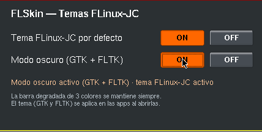
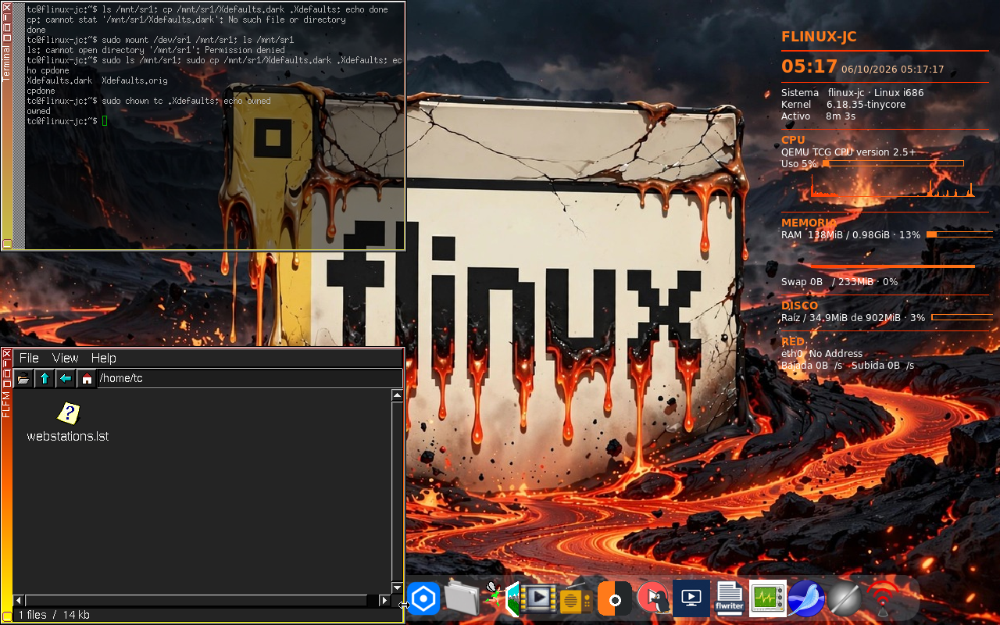

# FLSkin — Temas para FLinux-JC

FLSkin cambia el aspecto de **FLinux-JC** (Tiny Core Linux 17.1, 32 bits)
sin tocar la identidad de la distro: el fondo, el Conky, el tema GTK y el
modo oscuro de las aplicaciones, desde una ventana con dos interruptores.


## Capturas

La ventana de FLSkin, con los dos interruptores en ON:



Con el modo oscuro activo, las aplicaciones FLTK abren en oscuro: el
gestor de archivos FLFM en la esquina inferior izquierda, sobre el fondo
de lava de FLinux-JC:



## Cómo se usa

1. Abre **FLSkin** desde el icono del wbar o ejecutando `flskin`.
2. **«Tema FLinux-JC por defecto»**
   - **ON**: el aspecto de la ISO — fondo de lava, iconos Adwaita y
     Conky naranja.
   - **OFF**: aspecto base neutro — fondo sólido, GTK Raleigh, iconos
     hicolor y Conky gris azulado.
3. **«Modo oscuro (GTK + FLTK)»**
   - **ON**: Adwaita-dark para las aplicaciones GTK y paleta oscura
     para las FLTK (FLFM, FLRadio, FLTube, FLWriter, FLConnect…).
   - **OFF**: vuelta al tema claro.
4. El botón activo va resaltado en naranja. El cambio de tema (fondo y
   Conky) se ve al momento; el de GTK/FLTK se aplica en las aplicaciones
   que **abras después** — las ya abiertas conservan su aspecto hasta
   reabrirlas.

La barra de título de FLWM, con su degradado de tres colores, no se toca
en ningún modo: es parte de FLinux-JC y va siempre.

FLSkin corre como el usuario `tc`, sin root. Su estado se guarda en
`~/.flskin.conf` y todo lo que escribe vive bajo `$HOME`, así que la
copia de seguridad habitual de Tiny Core (filetool) lo conserva entre
reinicios.

## Cómo está hecho

Un solo archivo de C++ con FLTK 1.3 (`flskin.cpp`). Al pulsar un
interruptor, FLSkin escribe la configuración que cada toolkit lee al
arrancar y guarda su estado en `~/.flskin.conf`:

- `~/.gtkrc-2.0` — tema e iconos GTK2 (Adwaita, Adwaita-dark o Raleigh).
- `~/.config/gtk-3.0/settings.ini` — lo mismo para GTK3.
- `~/.Xdefaults` — la paleta oscura de FLTK va en un bloque marcado
  (`! FLSKIN-DARK-BEGIN` … `! FLSKIN-DARK-END`) que se añade o se retira
  sin tocar el resto del archivo.
- El tema Adwaita-dark real va **incluido en el paquete**, porque el
  repositorio de Tiny Core no lo trae.

Al cambiar el tema por defecto, además, copia el Conky elegido a
`~/.conkyrc` y pone el fondo con `flbg` (el de lava o el neutro que trae
el paquete); conky y wbar se reinician para recoger el nuevo fondo.
FLWM no se modifica en ningún caso.

## Instalación

De la **Release v1.0** descarga los tres archivos, juntos:

- `flskin.tcz` — la extensión.
- `flskin.tcz.dep` — dependencias (solo `fltk-1.3.tcz`).
- `flskin.tcz.md5.txt` — suma MD5 para comprobar la descarga.

**Tamaño:** 53 248 bytes · **MD5:** `c1c605b0572c7298739903ccc05c62e7`

```sh
md5sum -c flskin.tcz.md5.txt
tce-load -i flskin.tcz
```

(carga también `fltk-1.3.tcz` si no lo tienes), y abre FLSkin desde el
icono o ejecutando `flskin`.

## Compilar

En Tiny Core 32 bits con FLTK 1.3 de desarrollo:

```sh
g++ -O2 -o flskin flskin.cpp $(fltk-config --cxxflags --ldflags)
```

## Créditos

- **FLinux-JC** — la distribución para la que está pensado.
- La **comunidad FLTK**, por la biblioteca gráfica.
- **Tiny Core Linux**, por la base.

## Licencia

GPL-3.0 (archivo `LICENSE`).
